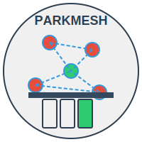
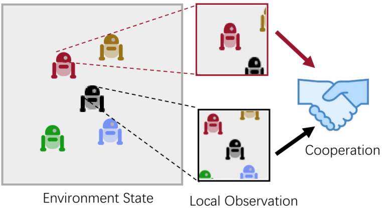
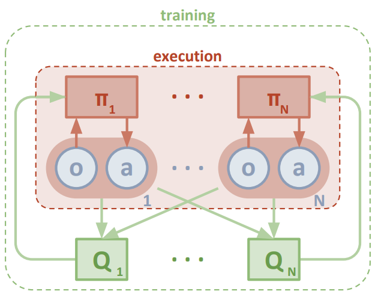

# 🚗 Parkmesh

  
   
   

  
  
  
  

## 📋 Overview

**Parkmesh** is a revolutionary smart parking solution that transforms ordinary vehicles into nodes in a city-wide mesh network, enabling real-time parking vacancy detection and information sharing. Using Multi-Agent Reinforcement Learning (MARL) and Graph Neural Networks (GNNs), Parkmesh creates a self-organizing network that guides drivers directly to available parking spaces.

  

## 🔍 The Problem

Urban drivers waste **$345 billion annually** circling for parking spaces due to information asymmetry:

- 🕒 Time wasted searching for parking spots
- ⛽ Excessive fuel consumption and emissions
- 🚦 Increased urban congestion
- 😤 Driver stress and frustration

## 💡 Our Solution

Parkmesh deploys ultra-low-power proximity sensors and Bluetooth mesh microcontrollers on vehicles, creating a dynamic network that:

1. Detects adjacent parking vacancies
2. Relays real-time information through the mesh
3. Provides drivers with accurate, up-to-date parking availability maps
4. Guides vehicles directly to open spaces

  

## 🧠 Technology Stack

- **Model**: MAGAC (Multi-Agent Graph Soft Actor Critic)
- **Framework**: Centralized Training with Decentralized Execution (CTDE)
- **Algorithms**: Soft Actor-Critic (SAC), Graph Neural Networks (GNNs)
- **Implementation**: PyTorch with PyTorch Geometric
- **Simulation**: CityFlow, CARLA, or SUMO
- **Multi-agent Environment**: PettingZoo
- **Distributed Computing**: Ray cluster with Docker Compose

## 🎯 Target Users

Our solution targets urban commuters who:

- ⏱️ Value their time highly
- 🔄 Spend 5-15 minutes daily searching for parking
- 💰 Want to reduce wasted fuel costs
- 🌿 Wish to minimize their environmental impact
- 😟 Experience stress from parking uncertainty

## 🚀 Benefits

- **Minimal Infrastructure**: No need for expensive fixed sensor deployments
- **Organic Scaling**: Network grows naturally with user adoption
- **Immediate Value**: Time savings from day one
- **Environmental Impact**: Reduced emissions from less circling
- **Cost Savings**: Lower fuel consumption and vehicle wear

## 📊 Implementation Plan

1. **Prototype**: Small area deployment and testing
2. **Scale**: Expand to entire city zones
3. **Deploy**: Hardware-in-the-loop real-world implementation
